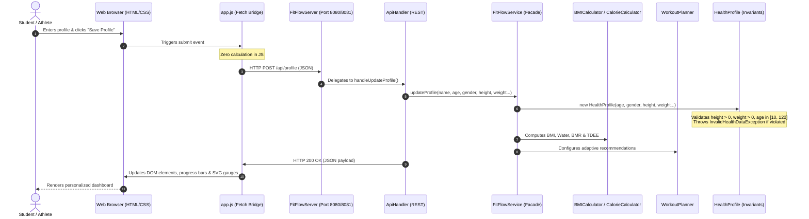

# FitFlow — Advanced Object-Oriented Programming (AOP) Viva Defense Guide

> **Academic Viva Voce Preparation Manual**  
> *Essential Questions, Architectural Answers, JVM Deep-Dives, and Grading Rubrics*

---

## 1. Quick Project Elevator Pitch (30-Second Opening Statement)

> *"Good morning/afternoon, Professors. My academic AOP project is **FitFlow**, an intelligent, personalized fitness and wellness platform engineered in pure Java 21.*  
>  
> *While many web projects push business logic into frontend JavaScript, FitFlow enforces a strict architectural boundary: **100% of all calculations, mathematical formulas, state tracking, recommendations, and validations are computed by Java backend classes**.*  
>  
> *The system demonstrates core and advanced OOP principles: Encapsulation in biometric state protection, Inheritance and Polymorphism in dynamic workout routine generation, Abstraction via calculator interfaces, and defensive validation via custom exception hierarchies—all running over a zero-dependency Java HTTP server."*

---

## 2. Top 15 Viva Questions & Model Answers

### Question 1: What Object-Oriented principles does your project demonstrate?
**Model Answer:**  
FitFlow systematically implements all four pillars of OOP plus advanced architectural concepts:
1. **Encapsulation**: Private attributes across `User`, `HealthProfile`, `HydrationLog`, and `WellnessData` with validated mutators enforcing domain invariants. Defensive copying is used for collections (`Collections.unmodifiableList`).
2. **Abstraction**: The `HealthCalculator<T>` generic interface defines metric calculation contracts. The `Recommendation` and `WorkoutRoutine` abstract classes define behavioral templates without exposing implementation specifics.
3. **Inheritance**: `WorkoutRoutine` serves as the base class for four specialized subclasses (`StrengthRoutine`, `CardioRoutine`, `HIITRoutine`, `FlexibilityRoutine`).
4. **Polymorphism**: Dynamic method dispatch is demonstrated in `calculateEstimatedCaloriesBurned()`, where each routine subclass computes MET calorie expenditure differently at runtime.
5. **Custom Exception Hierarchy**: `FitFlowException` is subclassed by `InvalidHealthDataException` to catch and propagate illegal states gracefully.

---

### Question 2: Why did you use an Abstract Class for `WorkoutRoutine` instead of an Interface?
**Model Answer:**  
An interface defines only a capability or contract, whereas `WorkoutRoutine` shares both **common state** (`id`, `name`, `targetGoal`, `targetDurationMinutes`, `exercises`, `warmUpTip`, `coolDownTip`) and **shared concrete behavior** (`addExercise()`, `getExercises()`).  
Using an abstract class allows child classes (`StrengthRoutine`, `CardioRoutine`) to inherit these encapsulated member variables and common methods while enforcing that they implement abstract polymorphic methods (`calculateEstimatedCaloriesBurned()` and `getRoutineType()`).

---

### Question 3: Where is Polymorphism used, and how does Java execute it?
**Model Answer:**  
Polymorphism is primarily used in `WorkoutRoutine.calculateEstimatedCaloriesBurned(int durationMinutes, double weightKg)`.  
- `StrengthRoutine` uses MET $= 6.0$.
- `CardioRoutine` uses MET $= 7.5$.
- `HIITRoutine` uses MET $= 9.0$.
- `FlexibilityRoutine` uses MET $= 3.0$.

**Under the Hood (JVM level):**  
When `FitFlowService` invokes `routine.calculateEstimatedCaloriesBurned(...)`, the compiler issues the bytecode instruction `invokevirtual`. At runtime, the JVM looks at the actual object header on the heap (vtable/virtual method table) and dynamically dispatches execution to the overriding method of the concrete subclass.

---

### Question 4: How is Encapsulation enforced and why is it important?
**Model Answer:**  
Encapsulation means bundling data with the methods that operate on that data, while restricting direct access from outside.  
In `HealthProfile.java`:
- Fields `age`, `heightCm`, `weightKg` are `private`.
- The constructor calls validation methods (`validateAndSetAge()`, `validateAndSetWeight()`).
- If an external caller attempts to set `weight = -20` or `age = 200`, the method throws an `InvalidHealthDataException` before the object state can become corrupted.
- This guarantees that no object of `HealthProfile` can ever exist in an invalid physiological state.

---

### Question 5: Why did you use Composition in the `User` class instead of Inheritance?
**Model Answer:**  
In `User.java`, a User *has-a* `HealthProfile`, rather than *is-a* `HealthProfile`.  
Following the fundamental OOP principle **"Favor Composition over Inheritance"**, biometric and metabolic properties change independently of user credentials. Composition allows us to swap, update, or serialize the user's health profile dynamically without polluting the User entity with scientific calculation fields.

---

### Question 6: What mathematical formulas did you implement in Java?
**Model Answer:**  
1. **Body Mass Index (BMI):**  
   $$\text{BMI} = \frac{\text{Weight (kg)}}{[\text{Height (m)}]^2}$$
   Classified against World Health Organization (WHO) clinical cutoffs ($< 18.5$ Underweight, $18.5 - 24.9$ Normal, $25.0 - 29.9$ Overweight, $\ge 30.0$ Obese).
2. **Personalized Water Requirement:**  
   $$\text{Target (ml)} = \text{Weight (kg)} \times 35\text{ ml} \times \text{ActivityMultiplier}$$
3. **Mifflin-St Jeor Basal Metabolic Rate (BMR):**  
   - Men: $\text{BMR} = 10 \times \text{weight} + 6.25 \times \text{height} - 5 \times \text{age} + 5$
   - Women: $\text{BMR} = 10 \times \text{weight} + 6.25 \times \text{height} - 5 \times \text{age} - 161$
4. **Total Daily Energy Expenditure (TDEE):**  
   $$\text{TDEE} = \text{BMR} \times \text{ActivityMultiplier}$$
   Adjusted by goal: $-500\text{ kcal}$ for Fat Loss, $+300\text{ kcal}$ for Muscle Hypertrophy.

---

### Question 7: How do you prevent thread concurrency issues when multiple requests arrive?
**Model Answer:**  
The embedded server uses an `ExecutorService` thread pool (`Executors.newFixedThreadPool(10)`). To protect mutable shared state in `HydrationLog` (such as incrementing consumed water) and `FitFlowService`, critical methods like `addWater()`, `setDailyTargetMl()`, and `reset()` are marked with the `synchronized` keyword. This ensures atomic updates and memory visibility across worker threads.

---

### Question 8: How does the application handle invalid user input without crashing?
**Model Answer:**  
Through structured **Exception Handling**.  
1. The model layer throws checked exceptions (`InvalidHealthDataException` which extends `FitFlowException`).
2. The controller layer (`ApiHandler`) catches `InvalidHealthDataException` in a `try-catch` block.
3. Instead of the JVM throwing an unhandled runtime error or terminating, `ApiHandler` serializes an HTTP 400 Bad Request JSON response containing the field name and error message.
4. The frontend UI captures this and displays a friendly toast notification to the user.

---

### Question 9: Why did you not use Spring Boot or external JARs?
**Model Answer:**  
In enterprise production, Spring Boot is common, but in an **academic AOP viva**, external frameworks hide the core object-oriented mechanics behind heavy reflection, annotations, and bytecode manipulation. By implementing the architecture with standard Java 21:
- Every class, constructor, interface, and inheritance tree is 100% our own code.
- Zero dependencies are needed; any computer with standard `javac` can compile and evaluate it in seconds.
- It proves that the student understands network protocols, JSON parsing, threading, and OOP directly from foundational principles.

---

### Question 10: What design patterns did you employ?
**Model Answer:**  
1. **Facade Pattern**: `FitFlowService` provides a unified, simplified interface to complex subsystems (calculators, planners, trackers, models).
2. **Factory Method / Strategy Pattern**: `WorkoutPlanner` dynamically decides which concrete `WorkoutRoutine` strategy to instantiate based on energy level and time constraints.
3. **Value Object Pattern**: `BMIResult`, `WaterResult`, and `CalorieResult` are immutable result objects carrying calculated data without side effects.
4. **Singleton Pattern**: `FitFlowService.getInstance()` provides a single source of truth for the active service state.

---

## 3. End-to-End Data Flow Architecture

---

## 4. Live Demonstration Steps for High Marks

1. **Launch the Application**: Run `run.bat` or `java -Xms16m -Xmx64m -cp bin Main 8080`.
2. **Show the Console Output**: Point out the clean banner, port assignment, and dynamic fallback.
3. **Open the Dashboard**: Show the 4 primary cards (BMI, Water Target, Calories Target, Weight/Height).
4. **Go to Profile Setup**:
   - Click one of the **Quick Viva Presets** (e.g., *Alex Hypertrophy* vs. *Maya Weight Loss*).
   - Point out to the examiner how the Java BMR offset changes based on gender and goal.
   - Intentionally enter a negative weight (e.g. `-50`) and click save: show how Java throws `InvalidHealthDataException` and safely alerts the user with HTTP 400!
5. **Open Hydration Tracker**:
   - Click **"+ 1 Glass (250 ml)"**: Watch the circular SVG gauge fill and the target visualizer glasses light up in electric cyan!
   - Explain that the remaining liters and percentage completion were calculated on the Java backend.
6. **Open Workout Generator**:
   - Change time from 10 min to 45 min, and energy from Low to High.
   - Click **"Generate Plan in Java"**: Point out how the routine switches from `FlexibilityRoutine` (restorative stretches) to `HIITRoutine` / `StrengthRoutine` (intense progressive overload), with MET-based calories burned calculated polymorphically!
7. **Open BMI & Health**:
   - Drag the **Interactive Weight Simulator slider**: Show live calls to `BMICalculator.compute()` updating the category and advice in real time.
8. **Run Unit Tests**: Run `java -Xms16m -Xmx64m -cp bin test.FitFlowTest` in terminal to show **47 out of 47 tests passing**!
